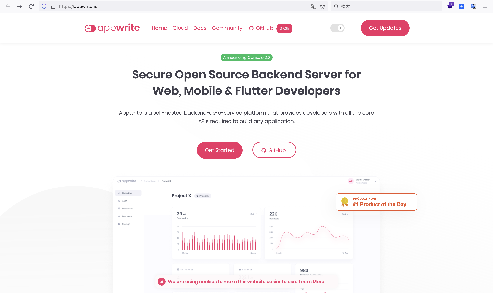
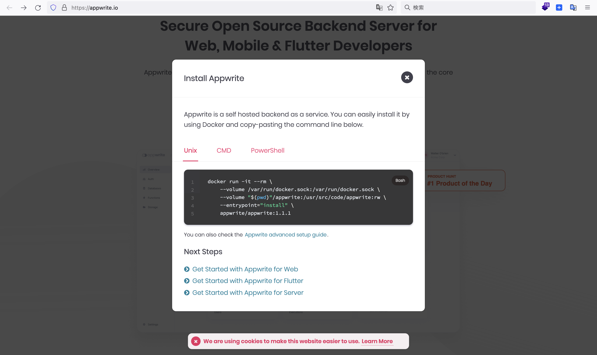

# appwrite-sample

this is appwrite sample

### first step


https://appwrite.io/

```
Web、モバイル、Flutter 開発者向けの安全なオープンソース バックエンド サーバー
Appwrite は、自己ホスト型のサービスとしてのバックエンド プラットフォームであり、アプリケーションの構築に必要なすべてのコア API を開発者に提供します。
```



<details>

```sh
➜  appwrite-sample git:(main) code .
➜  appwrite-sample git:(main) docker run -it --rm \
    --volume /var/run/docker.sock:/var/run/docker.sock \
    --volume "$(pwd)"/appwrite:/usr/src/code/appwrite:rw \
    --entrypoint="install" \
    appwrite/appwrite:1.1.1
Unable to find image 'appwrite/appwrite:1.1.1' locally
1.1.1: Pulling from appwrite/appwrite
9981e73032c8: Pull complete
2f69c83c314e: Pull complete
6c8f271730dc: Pull complete
08d1df3f0f22: Pull complete
6ff1966f32b0: Pull complete
bba6ffe303dc: Pull complete
fc83370396f5: Pull complete
34a60504136c: Pull complete
2f4475a0d1fe: Pull complete
cd24027bb1e2: Pull complete
09f48860b459: Pull complete
dae19fc60aa6: Pull complete
4f4fb700ef54: Pull complete
a52a3eccf1db: Pull complete
2a084f8cfaa9: Pull complete
66fc1bf9509c: Pull complete
18f3d6dd5da8: Pull complete
3e58b47ff65d: Pull complete
39c009892f93: Pull complete
06c787820484: Pull complete
6280ca3c2c46: Pull complete
8471f0736528: Pull complete
ae62918665d0: Pull complete
912d0ec01241: Pull complete
1f1f0f826b9d: Pull complete
d3eb9a79f844: Pull complete
b5db86dcad93: Pull complete
4d01ce20ec42: Pull complete
f919b45ceaaf: Pull complete
e54dc6fe099c: Pull complete
067ca979bbdc: Pull complete
99db94e376cf: Pull complete
f227888f305f: Pull complete
5fcf14833896: Pull complete
92f87656b216: Pull complete
c1ac4adb387d: Pull complete
d94ed26dfd9e: Pull complete
47d24e3c677a: Pull complete
0a9ad0a2bdee: Pull complete
045b213b9193: Pull complete
1f553a35d16e: Pull complete
353454c2d5f9: Pull complete
932a336c8520: Pull complete
d419c52ff426: Pull complete
Digest: sha256:412620db99175912b37870202848a1d2232eb408a0d3d45f05325ae8a3fb35ef
Status: Downloaded newer image for appwrite/appwrite:1.1.1
Starting Appwrite installation...
Choose your server HTTP port: (default: 80)

Choose your server HTTPS port: (default: 443)

Choose a secret API key, make sure to make a backup of your key in a secure location (default: 'your-secret-key')

Enter your Appwrite hostname (default: 'localhost')

Enter a DNS A record hostname to serve as a CNAME for your custom domains.
You can use the same value as used for the Appwrite hostname. (default: 'localhost')

Running "docker compose -f /usr/src/code/appwrite/docker-compose.yml up -d --remove-orphans --renew-anon-volumes"

Appwrite installed successfully
➜  appwrite-sample git:(main) ✗
```

<details>

http://localhost/login
